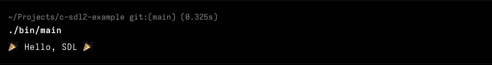
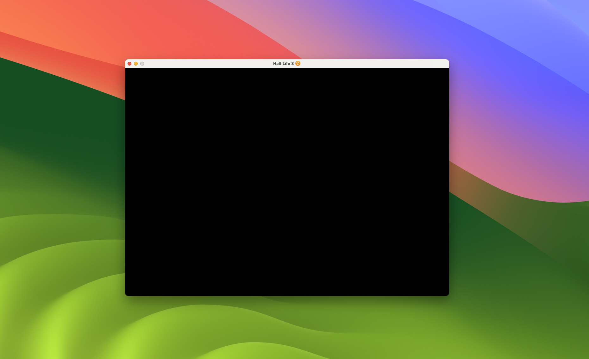

# C SDL2 Example

A setup of SDL2 with all the libraries available in the project folder.

## Setup

To compile the program use: 

```bash
make
```

To run it:

```bash
./bin/main
```

To clear compiled files:

```bash
make clean
```

> [!TIP]
> If VS Code is not detecting the path to SDL add them to the path by adding `"${workspaceFolder}/include"` in the Microsoft C/C++ Extension.

# Examples

## `main.c`


## `blank_window.c`
